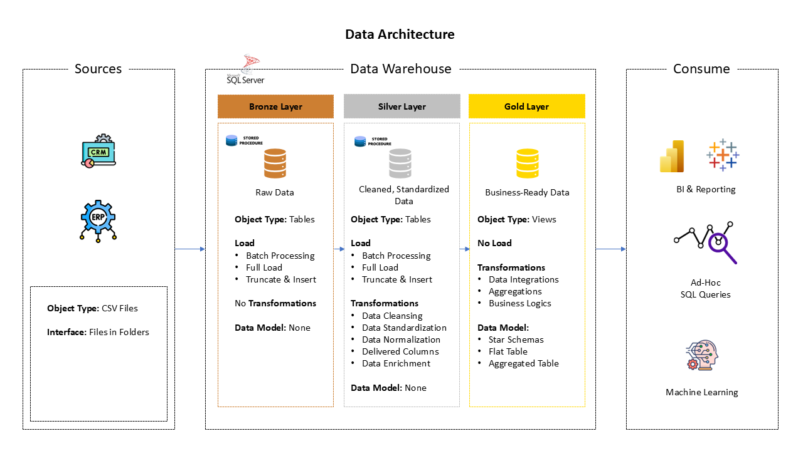

# Data Warehouse and Analytics Portfolio Project

This repository presents an end-to-end **SQL Server data warehouse and analytics project**. It demonstrates how raw CRM and ERP data can be ingested, cleaned, transformed, modeled, and prepared for business reporting using a structured medallion-style architecture.

The project is designed as a practical portfolio project to showcase skills in **SQL development, ETL design, data modeling, data warehousing, and analytical reporting**.

---

## Project Summary

The goal of this project is to build a modern data warehouse that consolidates sales-related data from multiple source systems and transforms it into a clean, business-ready analytical model.

The project covers the full data workflow:

1. **Data ingestion** from CSV files into SQL Server.
2. **Raw data storage** in the Bronze layer.
3. **Data cleansing and standardization** in the Silver layer.
4. **Business-ready modeling** in the Gold layer.
5. **SQL-based analytics** for customer, product, and sales insights.

---

## Data Architecture

The solution follows a **Bronze, Silver, and Gold** layered architecture.



### Bronze Layer

The Bronze layer stores the source data in its original form.

- Source systems: CRM and ERP
- Source format: CSV files
- Storage type: SQL Server tables
- Load method: Batch processing
- Transformation: None

This layer preserves raw data for traceability and auditing.

### Silver Layer

The Silver layer contains cleaned and standardized data.

Key activities include:

- Data cleansing
- Data standardization
- Data normalization
- Handling missing or inconsistent values
- Creating derived columns where needed
- Preparing data for integration

This layer improves data quality and creates a reliable foundation for analytics.

### Gold Layer

The Gold layer contains business-ready data modeled for reporting and analysis.

Key outputs include:

- Dimension tables
- Fact tables
- Star schema model
- Aggregated and reporting-friendly views

This layer supports business intelligence, ad-hoc SQL queries, and analytical use cases.

---

## Project Objectives

### Data Engineering Objective

Build a SQL Server-based data warehouse that consolidates CRM and ERP sales data into a clean and reliable analytical model.

The data engineering scope includes:

- Importing source data from CSV files
- Creating Bronze, Silver, and Gold schemas
- Designing ETL scripts using SQL
- Cleaning and transforming raw data
- Integrating data from multiple systems
- Building fact and dimension models
- Documenting data flow and data model design

### Analytics Objective

Develop SQL-based reports that provide insights into:

- Customer behavior
- Product performance
- Sales trends
- Revenue patterns
- Business performance indicators

These analytical outputs help stakeholders understand key business metrics and support data-driven decision-making.

---

## Repository Structure

```text
data-warehouse-project/
│
├── datasets/
│   └── Raw CRM and ERP CSV files used as source data
│
├── scripts/
│   ├── bronze/                         # SQL scripts for raw data loading
│   ├── silver/                         # SQL scripts for cleansing and transformation
│   └── gold/                           # SQL scripts for analytical views and models
│
├── tests/
│   └── Data quality checks and validation scripts
│
├── README.md                           # Project documentation
├── LICENSE                             # License information
└── .gitignore                          # Git ignored files and folders
